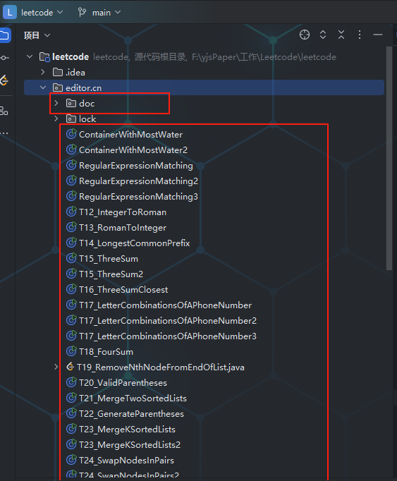

# leetcode

#### 介绍
Leetcode刷题仓库，题目有多种解法时候，会以后缀 2 3 结尾，表示方式2 方式3解法，项目所使用的JDK为JDK21 ,支持jdk8，但原则最好保持同步
题目会设有main方法以及sout方法，把本项目自行导入到idea中，可以下载插件Leetcode进行登录调试代码使用，欢迎提交issue~

力扣用户名为：zxlcode  --》leetcode有详细分析

此仓库完全公开，旨在共同拿下算法！！！

## 内容说明
1. 每道题目目录以`T_编号_题目英文名称`命名。
2. 各题目目录下包含：
    - 各种语言实现的解法文件（命名格式为`solutionX.语言后缀`）
    - `README.md`文件，记录题目描述、解题思路以及复杂度分析。

## 特性
- **单语言支持**：Java、种编程语言的实现。
- **解题多样性**：提供不同的解法，探索各种算法优化。
- **可读性**：代码注释详细，便于理解和复习。

## 使用方法
1. Clone 仓库：
   ```bash
   git clone https://github.com/your-username/your-repo-name.git

2. 导入项目
    
    - doc目录是Leetcode题目所对应的思路文档
    - T_编号_题目英文名称是所对应的Java源码
    - 进行排序了，请自行官网查找题目，找到本仓库所对应的题目代码以及解析(比如T743_NetworkDelayTime代表的就是Leetcode题目743，后面如果有数字2的话表示第二种解法，对应的文档在doc目录下，命名保持同步)

### 题目完成情况  对应的解答文档在doc目录下面的content文件夹里

#### 1. 2024年11月25日

   - T743_NetworkDelayTime
   - T1451_RearrangeWordsInASentence
   - T38_CountAndSay
   - T39_CombinationSum
   - T40_CombinationSumIi
   - T41_FirstMissingPositive
   - T42_TrappingRainWater 14:34

#### 2. 2024年11月26日 
  - T33_SearchInRotatedSortedArray
  - T43_MultiplyStrings
  - T34_FindFirstAndLastPositionOfElementInSortedArray  方式一（两个for循环--》没考虑时间复杂度）
  - T34_FindFirstAndLastPositionOfElementInSortedArray2 方式二（二分查找）
  - T44_WildcardMatching（测试用例没有全过） 11:27
  - T45_JumpGameIi 15:55
  - T46_Permutations
  - T47_PermutationsIi 16:21

#### 3. 2024年11月27日
  - T48_RotateImage 19:48
  - T49_GroupAnagrams 20:16
  - T50_PowxN 20:25

#### 4. 2024年11月28日
  - T53_MaximumSubarray 16:47
  - T54_SpiralMatrix 17:21
  - T55_JumpGame 17:37
  - T56_MergeIntervals 17:57
  - T57_InsertInterval
  - T58_LengthOfLastWord
  - T51_NQueens
  - T52_NQueensII

#### 5. 2024年11月29日
  - T60_PermutationSequence
  - T61_RotateList
  - T66_PlusOne
  - T69_Sqrtx
  - T70_ClimbingStairs
  - T70_ClimbingStairs2

#### 6. 2024年12月02日
   - T70_ClimbingStairs 使用迭代（动态规划）实现
   - T71_SimplifyPath 15:03
   - T72_EditDistance 15:47
   - T73_SetMatrixZeroes 15:53
   - T74_SearchA2dMatrix 16:15
   - T75_SortColors 16:25
   - T76_MinimumWindowSubstring 19:03

#### 7. 2024年12月04日
   - T77_Combinations 19:26
   - T78_Subsets 19:33
   - T79_WordSearch

#### 8. 2024年12月08日
   - T80_RemoveDuplicatesFromSortedArrayIi
   - T81_SearchInRotatedSortedArrayIi
   - T82_RemoveDuplicatesFromSortedListIi
   - T83_RemoveDuplicatesFromSortedList

#### 9. 2024年12月09日
   - T84_LargestRectangleInHistogram
   - T84_LargestRectangleInHistogram2 (优化思路)
   - T85_MaximalRectangle
   - T86_PartitionList
   - T88_MergeSortedArray
   - T100_SameTree
   - T94_BinaryTreeInorderTraversal
   - T94_BinaryTreeInorderTraversal2

#### 10. 2024年12月12日
   - T95_UniqueBinarySearchTreesIi
   - T96_UniqueBinarySearchTrees
   - T96_UniqueBinarySearchTrees2
   - T98_ValidateBinarySearchTree
   - T101_SymmetricTree

#### 11. 2024年12月13日
   - T102_BinaryTreeLevelOrderTraversal
   - T104_MaximumDepthOfBinaryTree
   - T105_ConstructBinaryTreeFromPreorderAndInorderTraversal
   - T106_ConstructBinaryTreeFromInorderAndPostorderTraversal
   - T107_BinaryTreeLevelOrderTraversalIi
   - T108_ConvertSortedArrayToBinarySearchTree

#### 12. 2024年12月14日
   - T110_BalancedBinaryTree
   - T111_MinimumDepthOfBinaryTree
   - T112_PathSum
   - T113_PathSumIi
   - T114_FlattenBinaryTreeToLinkedList

#### 13. 2024年12月15日
   - T118_PascalsTriangle
   - T119_PascalsTriangleIi
   - T121_BestTimeToBuyAndSellStock
   - T122_BestTimeToBuyAndSellStockIi
   - T125_ValidPalindrome

#### 14. 2024年12月16日
   - T136_SingleNumber 只出现一次的数字
   - T120_Triangle 三角形最小路径和
   - T137_SingleNumberIi 只出现一次的数字II
   - T116_PopulatingNextRightPointersInEachNode
   - T124_BinaryTreeMaximumPathSum 二叉树中的最大路径和（未AC）
   - T117_PopulatingNextRightPointersInEachNodeIi

#### 15. 2024年12月17日
   - T109_ConvertSortedListToBinarySearchTree2 有序链表转换为二叉搜索数
   - T128_LongestConsecutiveSequence 最长连续序列
   - T129_SumRootToLeafNumbers 求根节点到叶节点数组之和
   - T141_LinkedListCycle 环形链表
   - T138_CopyListWithRandomPointer 随机链表复制

#### 16. 2024年12月18日
   - T142_LinkedListCycleIi 环形链表II
   - T143_ReorderList 重排链表
   - T144_BinaryTreePreorderTraversal1 二叉树的前序遍历（递归解法）
   - T144_BinaryTreePreorderTraversal2 二叉树的前序遍历（迭代解法）
   - T145_BinaryTreePostorderTraversal1 二叉树的后序遍历（递归解法）
   - T145_BinaryTreePostorderTraversal1 二叉树的后序遍历（迭代解法）
   - T139_WordBreak 单词拆分

#### 17. 2024年12月19日
   - T133_CloneGraph 克隆图
   - T134_GasStation 加油站
   - T146_LruCache LRU缓存
   - T147_InsertionSortList 对链表进行插入排序
   - T148_SortList 链表排序（使用归并排序完成）
   - T150_EvaluateReversePolishNotation 求逆波兰表达式（使用栈）

#### 18. 2024年12月20日
   - T151_ReverseWordsInAString (StringBuilder实现)
   - T152_MaximumProductSubarray 乘积最大子数组
   - T153_FindMinimumInRotatedSortedArray 寻找旋转排序数组的最小值
   - T154_FindMinimumInRotatedSortedArrayIi 寻找旋转排序数组的最小值II
   - T155_MinStack 最小栈
   - T160_IntersectionOfTwoLinkedLists 相交链表
   - T162_FindPeakElement 寻找峰值
   - T01_腾讯天美日常实习一面凉经
   - T02_携程java一面45min

#### 19. 2024年12月22日
   - T164_MaximumGap 最大间距
   - T168_ExcelSheetColumnTitle Excel表列名称
   - T165_CompareVersionNumbers 比较版本号

#### 20. 2024年12月23日
   - T166_FractionToRecurringDecimal 分数到小数
   - T169_MajorityElement 多数元素
   - T171_ExcelSheetColumnNumber 表列序号
   - T172_FactorialTrailingZeroes 阶乘后的零
   - T2545_SortTheStudentsByTheirKthScore 根据第K场考试的分数排序
   - T176_SecondHighestSalary 第二高薪水 （MySQL两种实现方式）

#### 21. 2024年12月24日
   - T177_NthHighestSalary 第N高的薪水