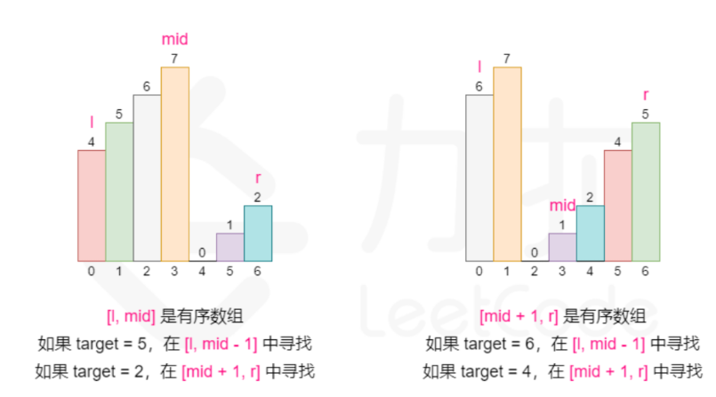

<p>整数数组 <code>nums</code> 按升序排列，数组中的值 <strong>互不相同</strong> 。</p>

<p>在传递给函数之前，<code>nums</code> 在预先未知的某个下标 <code>k</code>（<code>0 &lt;= k &lt; nums.length</code>）上进行了 <strong>旋转</strong>，使数组变为 <code>[nums[k], nums[k+1], ..., nums[n-1], nums[0], nums[1], ..., nums[k-1]]</code>（下标 <strong>从 0 开始</strong> 计数）。例如， <code>[0,1,2,4,5,6,7]</code> 在下标 <code>3</code> 处经旋转后可能变为&nbsp;<code>[4,5,6,7,0,1,2]</code> 。</p>

<p>给你 <strong>旋转后</strong> 的数组 <code>nums</code> 和一个整数 <code>target</code> ，如果 <code>nums</code> 中存在这个目标值 <code>target</code> ，则返回它的下标，否则返回&nbsp;<code>-1</code>&nbsp;。</p>

<p>你必须设计一个时间复杂度为 <code>O(log n)</code> 的算法解决此问题。</p>

<p>&nbsp;</p>

<p><strong>示例 1：</strong></p>

<pre>
<strong>输入：</strong>nums = [<span><code>4,5,6,7,0,1,2]</code></span>, target = 0
<strong>输出：</strong>4
</pre>

<p><strong>示例&nbsp;2：</strong></p>

<pre>
<strong>输入：</strong>nums = [<span><code>4,5,6,7,0,1,2]</code></span>, target = 3
<strong>输出：</strong>-1</pre>

<p><strong>示例 3：</strong></p>

<pre>
<strong>输入：</strong>nums = [1], target = 0
<strong>输出：</strong>-1
</pre>

<p>&nbsp;</p>

<p><strong>提示：</strong></p>

<ul> 
 <li><code>1 &lt;= nums.length &lt;= 5000</code></li> 
 <li><code>-10<sup>4</sup> &lt;= nums[i] &lt;= 10<sup>4</sup></code></li> 
 <li><code>nums</code> 中的每个值都 <strong>独一无二</strong></li> 
 <li>题目数据保证 <code>nums</code> 在预先未知的某个下标上进行了旋转</li> 
 <li><code>-10<sup>4</sup> &lt;= target &lt;= 10<sup>4</sup></code></li> 
</ul>

<div><li>👍 3057</li><li>👎 0</li></div>


我们知道，在一个有序的数组里面去判断一个数是否存在，可以利用二分查找，时间复杂度刚好就是$ O(\log{n}) $。


但这道题只是部分有序（因为旋转了），该怎么去判断呢？


闭上眼，想一下。


从任意位置将这个部分有序的数组分开，那么分开之后的两部分必然有一部分是有序的！


比如：


```plain
nums = [4,5,6,7,0,1,2]      
nums = [4] [5,6,7,0,1,2]	breakPos = 1
nums = [4,5] [6,7,0,1,2]    breakPos = 2
nums = [4,5,6] [7,0,1,2]    breakPos = 3
nums = [4,5,6,7] [0,1,2]    breakPos = 4
nums = [4,5,6,7,0] [1,2]    breakPos = 5
nums = [4,5,6,7,0,1] [2]    breakPos = 6
```


果然，至少有一部分是有序的。那我们是不是就可以从有序的部分当中去寻找 `target` 呢？


可以是可以，但时间复杂度并不是 $ O(\log{n}) $，还要加上 `breakPos` 分割后无序的部分，合起来就是$ O(n + \log{n}) $，显然也不符合题目的要求。


考虑下面的思路：


+ 如果`[lef,breakPos - 1]`是有序的，而且`nums[lef] <= target && target < nums[breakPos]`，那么答案肯定在`[lef, breakPos - 1]`，直接调整上界`rig`到`breakPos - 1`。
+ 如果`[breakPos，rig]`是有序的，而且`nums[breakPos] < target && target <= nums[rig]`，那么答案肯定在`[breakPos,rig]`中，调整下界`lef`到`breakPos`即可。





也就是说，我们通过判断有序的部分，来决定下一步的查找范围。


+ 只有在有序区间内才可以通过区间两端的数值判断 target 是否在其中。
+ 判断有序区间还是乱序区间：`left <= right` 是顺序区间，否则乱序区间。
+ 每次二分至少存在一个有序区间。


```java
class Solution {
    public int search(int[] nums, int target) {
        int siz = nums.length; // 数组长度
        int lef = 0, rig = siz - 1; // 初始化左右指针
        while (lef <= rig) { // 当左指针小于等于右指针时进行循环
            int mid = (lef + rig) >> 1; // 计算中间索引，使用右移运算符相当于除以 2
            if (nums[mid] == target) // 如果中间元素等于目标值，返回中间索引
                return mid;
            if (nums[0] <= nums[mid]) { // 如果左半部分有序
                if (nums[0] <= target && target < nums[mid]) // 如果目标值在左半部分范围内
                    rig = mid - 1; // 移动右指针
                else
                    lef = mid + 1; // 否则移动左指针
            } else { // 右半部分有序
                if (nums[mid] < target && target <= nums[siz - 1]) // 如果目标值在右半部分范围内
                    lef = mid + 1; // 移动左指针
                else
                    rig = mid - 1; // 否则移动右指针
            }
        }
        return -1; // 如果未找到目标值，返回 -1
    }
}
```


我们来分析一下代码的关键部分：


第一步，**初始化**：


+ `siz`：数组长度。
+ `lef` 和 `rig`：左右指针，分别初始化为数组的第一个和最后一个索引。


第二步，**二分查找**：


计算中间索引 `mid`；如果 `nums[mid]` 等于目标值 `target`，直接返回 `mid`。


检查数组的左半部分是否有序（`nums[0] <= nums[mid]`）。


如果左半部分有序，并且目标值在左半部分范围内（`nums[0] <= target && target < nums[mid]`），移动右指针到 `mid - 1`；否则，移动左指针到 `mid + 1`。


如果右半部分有序，并且目标值在右半部分范围内（`nums[mid] < target && target <= nums[siz - 1]`），移动左指针到 `mid + 1`；否则，移动右指针到 `mid - 1`。


第三步，如果循环结束仍未找到目标值，返回 `-1`。


假设数组为 `[4, 5, 6, 7, 0, 1, 2]`，目标值 `target` 为 `0`，我们来模拟一下整个题解过程：


1. 初始 `lef = 0`，`rig = 6`，`mid = 3`，`nums[mid] = 7`。
2. `nums[0] <= nums[mid]`，左半部分有序。
3. `0` 不在左半部分范围内，移动左指针 `lef = 4`。
4. 更新 `mid = 5`，`nums[mid] = 1`。
5. `nums[4] <= nums[mid]`，右半部分有序。
6. `0` 在右半部分范围内，移动右指针 `rig = 4`。
7. 更新 `mid = 4`，`nums[mid] = 0`，找到目标值，返回 `4`。

