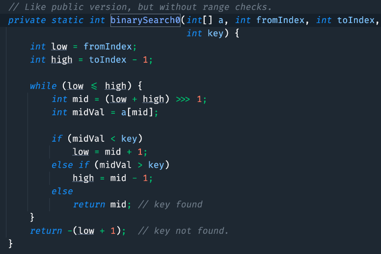

<p>给你一个按照非递减顺序排列的整数数组 <code>nums</code>，和一个目标值 <code>target</code>。请你找出给定目标值在数组中的开始位置和结束位置。</p>

<p>如果数组中不存在目标值 <code>target</code>，返回&nbsp;<code>[-1, -1]</code>。</p>

<p>你必须设计并实现时间复杂度为&nbsp;<code>O(log n)</code>&nbsp;的算法解决此问题。</p>

<p>&nbsp;</p>

<p><strong>示例 1：</strong></p>

<pre>
<strong>输入：</strong>nums = [<span><code>5,7,7,8,8,10]</code></span>, target = 8
<strong>输出：</strong>[3,4]</pre>

<p><strong>示例&nbsp;2：</strong></p>

<pre>
<strong>输入：</strong>nums = [<span><code>5,7,7,8,8,10]</code></span>, target = 6
<strong>输出：</strong>[-1,-1]</pre>

<p><strong>示例 3：</strong></p>

<pre>
<strong>输入：</strong>nums = [], target = 0
<strong>输出：</strong>[-1,-1]</pre>

<p>&nbsp;</p>

<p><strong>提示：</strong></p>

<ul> 
 <li><code>0 &lt;= nums.length &lt;= 10<sup>5</sup></code></li> 
 <li><code>-10<sup>9</sup>&nbsp;&lt;= nums[i]&nbsp;&lt;= 10<sup>9</sup></code></li> 
 <li><code>nums</code>&nbsp;是一个非递减数组</li> 
 <li><code>-10<sup>9</sup>&nbsp;&lt;= target&nbsp;&lt;= 10<sup>9</sup></code></li> 
</ul>

<div><li>👍 2842</li><li>👎 0</li></div>


当然了，题目要求的时间复杂度为 `O(log n)`，那么我们还是需要使用二分查找的。


怎么去使用二分查找法呢？


一开始，我们可能会想到直接查找数组中是否存在这个`target`值，然后再向左右扩展，可是这个思路如果遇到`nums = [5,5,5,5,5], target = 5`的情况，就需要遍历整个数组！


这时候，时间复杂度就又变成了$ O(n) $，而不是$ O(\log{n}) $。


怎么办呢？


如果用`C++`来解题的话，可以利用它自带的两个二分查找函数——`lower_bound()`和`upper_bound()`，`lower_bound()`会返回大于或者等于 **target** 的第一个元素的位置，`upper_bound()`会返回大于 **target** 的第一个元素。


但我们毕竟是 Java 选手，Java 有这样类似的方法吗？


我能想到的是`Arrays.binarySearch()`，但该方法只负责找到一个，并不区分是第一个还是最后一个。





那我们就需要自定义方法来模拟 `lower_bound()`和`upper_bound()`这两个方法了。


辅助方法 findFirstPosition：


```java
// 查找目标值的第一个位置
private int findFirstPosition(int[] nums, int target) {
    int left = 0;
    int right = nums.length - 1;
    while (left <= right) {
        int mid = left + (right - left) / 2;
        if (nums[mid] < target) {
            left = mid + 1;
        } else if (nums[mid] > target) {
            right = mid - 1;
        } else {
            // 如果 mid 是第一个元素或者前一个元素不等于 target，mid 就是第一个位置
            if (mid == 0 || nums[mid - 1] != target) {
                return mid;
            }
            // 否则在左半部分继续查找
            right = mid - 1;
        }
    }
    return -1;
}
```


①、初始化左右指针 left 和 right。


②、当 left 小于等于 right 时，计算中间位置 mid。


③、如果中间值 `nums[mid]` 小于目标值 target，移动左指针 left 到 mid + 1。


④、如果中间值 `nums[mid]` 大于目标值 target，移动右指针 right 到 mid - 1。


⑤、如果中间值 `nums[mid]` 等于目标值 target：


+ 检查 mid 是否为第一个元素或其前一个元素是否不等于目标值。如果是，则返回 mid。
+ 否则，将右指针 right 移动到 mid - 1 继续查找。


假如输入是 `nums = [5,7,7,8,8,10]` 和 target = 8，我们来模拟一下 findFirstPosition 方法。


①、初始状态：left = 0, right = 5


②、第一次循环：


+ mid = (0 + 5) / 2 = 2
+ `nums[mid] = nums[2] = 7`, 小于 target = 8
+ 更新 left = mid + 1 = 3，在右半部分


③、第二次循环：


+ mid = (3 + 5) / 2 = 4
+ `nums[mid] = nums[4] = 8`, 等于 target = 8
+ mid 不是第一个元素且 `nums[mid - 1] = nums[3] = 8`，继续向左查找(说明左侧还有符合要求的)
+ 更新 right = mid - 1 = 3


④、第三次循环：


+ mid = (3 + 3) / 2 = 3
+ `nums[mid] = nums[3] = 8`, 等于 target = 8
+ mid 是第一个元素或者 `nums[mid - 1] != target`，即 `nums[2] = 7 != 8`
+ 返回 mid = 3


辅助方法 findLastPosition：


```java
// 查找目标值的最后一个位置
private int findLastPosition(int[] nums, int target) {
    int left = 0;
    int right = nums.length - 1;
    while (left <= right) {
        int mid = left + (right - left) / 2;
        if (nums[mid] < target) {
            left = mid + 1;
        } else if (nums[mid] > target) {
            right = mid - 1;
        } else {
            // 如果 mid 是最后一个元素或者后一个元素不等于 target，mid 就是最后一个位置
            if (mid == nums.length - 1 || nums[mid + 1] != target) {
                return mid;
            }
            // 否则在右半部分继续查找
            left = mid + 1;
        }
    }
    return -1;
}
```


①、初始化左右指针 left 和 right。


②、当 left 小于等于 right 时，计算中间位置 mid。


③、如果中间值 `nums[mid]` 小于目标值 target，移动左指针 left 到 mid + 1。


④、如果中间值 `nums[mid]` 大于目标值 target，移动右指针 right 到 mid - 1。


⑤、如果中间值 `nums[mid]` 等于目标值 target：


+ 检查 mid 是否为最后一个元素或其后一个元素是否不等于目标值。如果是，则返回 mid。
+ 否则，将左指针 left 移动到 mid + 1 继续查找。


最后，来调用两个辅助方法找到元素的第一个位置和最后一个位置。


```java
class Solution {
    public int[] searchRange(int[] nums, int target) {
        int[] result = new int[2];
        result[0] = findFirstPosition(nums, target);
        result[1] = findLastPosition(nums, target);
        return result;
    }
}
```