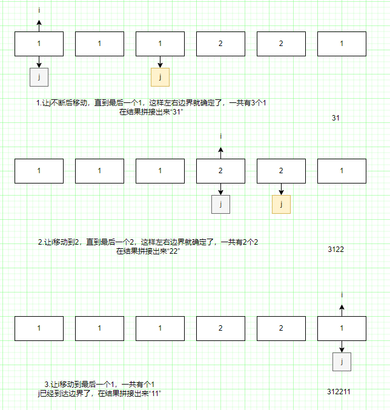

「外观数列」是一个数位字符串序列，由递归公式定义：

<ul> 
 <li><code>countAndSay(1) = "1"</code></li> 
 <li><code>countAndSay(n)</code> 是&nbsp;<code>countAndSay(n-1)</code> 的行程长度编码。</li> 
</ul>

&nbsp;

<ul> 
</ul>

<a href="https://baike.baidu.com/item/%E8%A1%8C%E7%A8%8B%E9%95%BF%E5%BA%A6%E7%BC%96%E7%A0%81/2931940">行程长度编码</a>（RLE）是一种字符串压缩方法，其工作原理是通过将连续相同字符（重复两次或更多次）替换为字符重复次数（运行长度）和字符的串联。例如，要压缩字符串&nbsp;<code>"3322251"</code>&nbsp;，我们将&nbsp;<code>"33"</code>&nbsp;用&nbsp;<code>"23"</code>&nbsp;替换，将&nbsp;<code>"222"</code>&nbsp;用&nbsp;<code>"32"</code>&nbsp;替换，将&nbsp;<code>"5"</code>&nbsp;用&nbsp;<code>"15"</code>&nbsp;替换并将&nbsp;<code>"1"</code>&nbsp;用&nbsp;<code>"11"</code>&nbsp;替换。因此压缩后字符串变为 <code>"23321511"</code>。

给定一个整数&nbsp;<code>n</code>&nbsp;，返回&nbsp;<strong>外观数列</strong>&nbsp;的第&nbsp;<code>n</code>&nbsp;个元素。

<strong>示例 1：</strong>

 
 
<strong>输入：</strong>n = 4
 

<strong>输出：</strong>"1211"

<strong>解释：</strong>

countAndSay(1) = "1"

countAndSay(2) = "1" 的行程长度编码 = "11"

countAndSay(3) = "11" 的行程长度编码 = "21"

countAndSay(4) = "21" 的行程长度编码 = "1211"

<strong class="example">示例 2：</strong>

 
 
<strong>输入：</strong>n = 1
 

<strong>输出：</strong>"1"

<strong>解释：</strong>

这是基本情况。

&nbsp;

<strong>提示：</strong>

<ul> 
 <li><code>1 &lt;= n &lt;= 30</code></li> 
</ul>

&nbsp;
 
<strong>进阶：</strong>你能迭代解决该问题吗？

<li>👍 1096</li><li>👎 0</li>

前五项如下：
1.     1       第一项是数字1
2.     11      描述前一项，这个数字是1 即 “一个1”，记作 “11”
3.     21      描述前一项，这个数字是2 即 “两个1”，记作 “21”
4.     1211    描述前一项，这个数字是1 即 “一个2”，记作 “11”，再描述前一项，这个数字是1 即 “一个1”，记作 “21”
5.     111221  描述前一项，这个数字是1 即 “一个1”，记作 “11”，再描述前一项，这个数字是2 即 “两个2”，记作 “12”，再描述前一项，这个数字是1 即 “一个2”，记作 “21”

使用递归实现，递归的边界条件是1,所以递归的终止条件是n=1，递归的递归条件是n>1，递归的递归过程是递归调用countAndSay(n-1)，然后根据countAndSay(n-1)的结果，进行解析，得到新的结果，然后返回。

以下是所绘制的流程图，其中draw.io 工具可以画流程图，可以下载使用。源流程文件保存在项目同级目录“算法图下面”。命名为  题号.draw.io(38. 外观数列.drawio)

