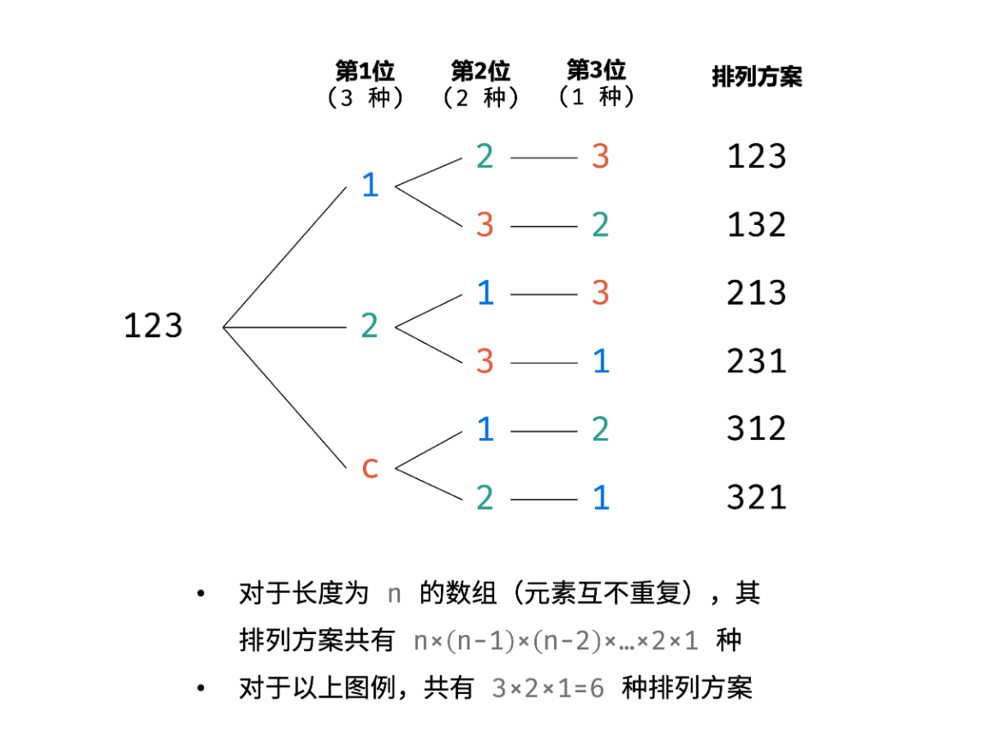
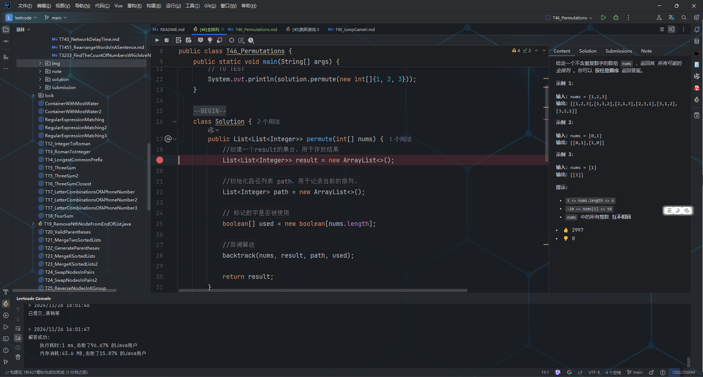

<p>给定一个不含重复数字的数组 <code>nums</code> ，返回其 <em>所有可能的全排列</em> 。你可以 <strong>按任意顺序</strong> 返回答案。</p>

<p>&nbsp;</p>

<p><strong>示例 1：</strong></p>

<pre>
<strong>输入：</strong>nums = [1,2,3]
<strong>输出：</strong>[[1,2,3],[1,3,2],[2,1,3],[2,3,1],[3,1,2],[3,2,1]]
</pre>

<p><strong>示例 2：</strong></p>

<pre>
<strong>输入：</strong>nums = [0,1]
<strong>输出：</strong>[[0,1],[1,0]]
</pre>

<p><strong>示例 3：</strong></p>

<pre>
<strong>输入：</strong>nums = [1]
<strong>输出：</strong>[[1]]
</pre>

<p>&nbsp;</p>

<p><strong>提示：</strong></p>

<ul> 
 <li><code>1 &lt;= nums.length &lt;= 6</code></li> 
 <li><code>-10 &lt;= nums[i] &lt;= 10</code></li> 
 <li><code>nums</code> 中的所有整数 <strong>互不相同</strong></li> 
</ul>

<div><li>👍 2997</li><li>👎 0</li></div>

## 分析


那我们就可以用回溯算法来解决，遍历数组的每一个元素，然后尝试生成所有的排列，当生成一个完整的排列时，记录该排列，并退回到上一步，然后继续生成新的排列。


就比如说“123”，我们可以先固定 1，然后递归处理 “23”。把 “123”、“132” 排列完成后，回溯到上一步，固定 2，然后递归处理 “13”，以此类推。


```java
public class Main04601 {

    public List<List<Integer>> permute(int[] nums) {
        List<List<Integer>> result = new ArrayList<>();
        List<Integer> path = new ArrayList<>();
        boolean[] used = new boolean[nums.length]; // 标记数字是否被使用
        backtrack(nums, result, path, used);
        return result;
    }

    // 回溯算法
    private void backtrack(int[] nums, List<List<Integer>> result, List<Integer> path, boolean[] used) {
        // 如果当前排列的长度等于 nums 的长度，则找到一个完整的排列
        if (path.size() == nums.length) {
            result.add(new ArrayList<>(path)); // 将当前排列加入结果列表
            return;
        }

        // 遍历每一个数字，尝试将其加入排列
        for (int i = 0; i < nums.length; i++) {
            // 如果该数字已经使用过，则跳过
            if (used[i]) {
                continue;
            }

            // 做选择：选择当前数字
            path.add(nums[i]);
            used[i] = true;

            // 继续递归处理剩余数字的排列
            backtrack(nums, result, path, used);

            // 撤销选择：回溯
            path.remove(path.size() - 1);
            used[i] = false;
        }
    }

    public static void main(String[] args) {
        Main04601 solution = new Main04601();
        int[] nums = {1, 2, 3};
        List<List<Integer>> result = solution.permute(nums);
        System.out.println(result); // 输出所有全排列
    }
}
```

简单解释一下。


①、主方法 `permute` 中：

+ 初始化结果列表 result，用于存储所有可能的排列。
+ 初始化路径列表 path，用于记录当前的排列。
+ 使用布尔数组 used 标记某个数字是否被使用。
+ 调用回溯算法 backtrack，开始生成排列。

②、回溯算法 `backtrack` 中：

+ 如果当前排列的长度等于 nums 的长度，则找到一个完整的排列，将其加入结果列表。
+ 遍历 nums 中的每一个数字，尝试将其加入排列。
+ 如果该数字已经使用过，则跳过。
+ 做选择：选择当前数字，将其加入排列，并标记为已使用。
+ 继续递归处理剩余数字的排列。
+ 撤销选择：回溯，将当前数字从排列中移除，并标记为未使用。


大家可以在 IntelliJ IDEA 中调试运行一遍，对整个题解的理解会更加深刻。



主要看 path 在整个递归过程中的变化。整个题解的效率还不错。

