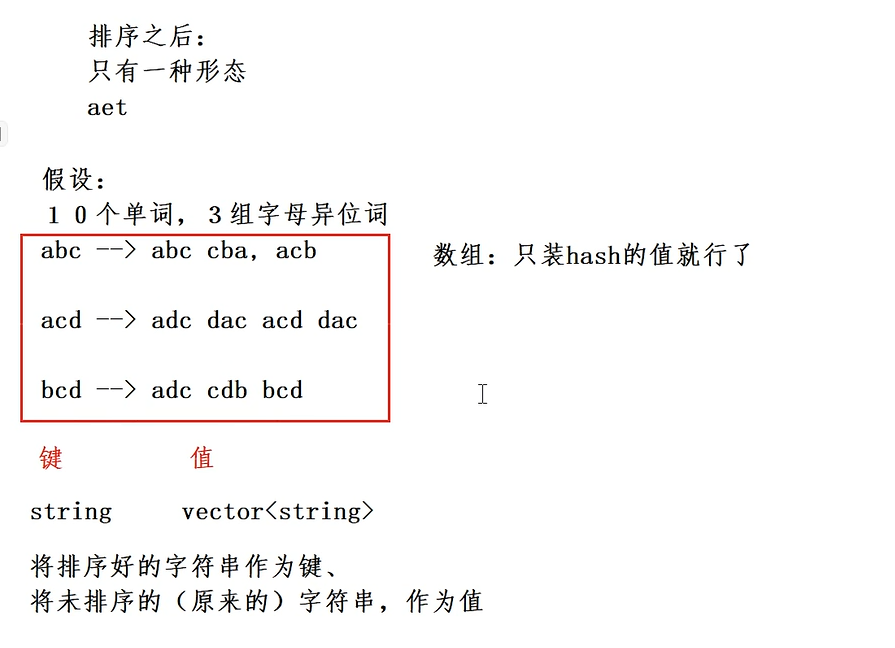
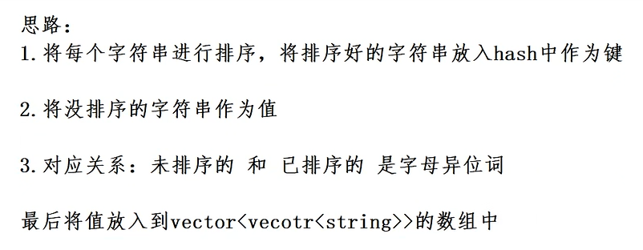
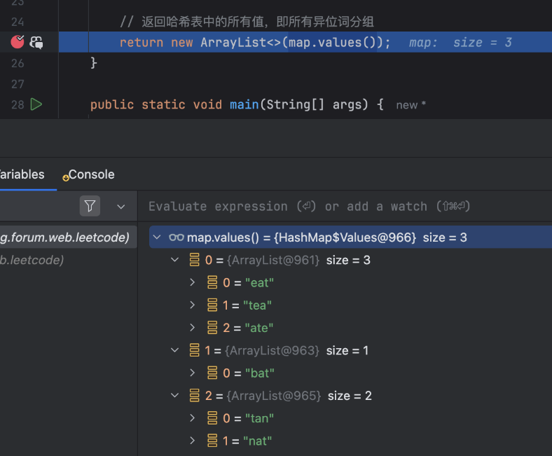

<p>给你一个字符串数组，请你将 <strong>字母异位词</strong> 组合在一起。可以按任意顺序返回结果列表。</p>

<p><strong>字母异位词</strong> 是由重新排列源单词的所有字母得到的一个新单词。</p>

<p>&nbsp;</p>

<p><strong>示例 1:</strong></p>

<pre>
<strong>输入:</strong> strs = <span><code>["eat", "tea", "tan", "ate", "nat", "bat"]</code></span>
<strong>输出: </strong>[["bat"],["nat","tan"],["ate","eat","tea"]]</pre>

<p><strong>示例 2:</strong></p>

<pre>
<strong>输入:</strong> strs = <span><code>[""]</code></span>
<strong>输出: </strong>[[""]]
</pre>

<p><strong>示例 3:</strong></p>

<pre>
<strong>输入:</strong> strs = <span><code>["a"]</code></span>
<strong>输出: </strong>[["a"]]</pre>

<p>&nbsp;</p>

<p><strong>提示：</strong></p>

<ul> 
 <li><code>1 &lt;= strs.length &lt;= 10<sup>4</sup></code></li> 
 <li><code>0 &lt;= strs[i].length &lt;= 100</code></li> 
 <li><code>strs[i]</code>&nbsp;仅包含小写字母</li> 
</ul>

<div><li>👍 2055</li><li>👎 0</li></div>


## 思路



### 题意

给你一个字符串数组，请你将 **字母异位词** 组合在一起。可以按任意顺序返回结果列表。


**字母异位词** 是由重新排列源单词的字母得到的一个新单词，所有源单词中的字母通常恰好只用一次。

### 难度

中等

### 示例

**示例 1:**

```plain
输入: strs = ["eat", "tea", "tan", "ate", "nat", "bat"]
输出: [["bat"],["nat","tan"],["ate","eat","tea"]]
```

**示例 2:**

```plain
输入: strs = [""]
输出: [[""]]
```

**示例 3:**

```plain
输入: strs = ["a"]
输出: [["a"]]
```

### 分析

这道题的重点是理解什么是**字母异位词**，简单点说，就是每个字母出的次数都一样的字符串。


也就是说，如果两个字符互为 **字母异位词**，那么分别对它们进行排序后，必然是两个相同的字符串。


我们可以借助这一特性，将每个字符串按照字符排序后作为哈希表的键，然后将相同键的字符串归为一组。


如果看过 [HashMap 的源码](https://javabetter.cn/collection/hashmap.html)，其实就能找到类似的感觉，哈希相同的时候会使用拉链法将 key 相同的归为一组，放在链表中。


1. 初始化一个哈希表 map，其中键是排序后的字符串，值是对应的异位词列表（[ArrayList](https://javabetter.cn/collection/arraylist.html)）。
2. 遍历输入数组中的每一个字符串，对字符串中的字符进行排序，然后将排序后的字符串作为键，将原始字符串添加到该键对应的列表中。
3. 遍历完成后，哈希表中的每个键对应的值就是一个字母异位词组。
4. 返回哈希表中的所有值（即字母异位词分组）。


来看题解：

```java
import java.util.*;

public class Solution {
    public List<List<String>> groupAnagrams(String[] strs) {
        // 创建哈希表，键是排序后的字符串，值是异位词列表
        Map<String, List<String>> map = new HashMap<>();
        
        // 遍历每一个字符串
        for (String str : strs) {
            // 将字符串转换为字符数组并排序
            char[] charArray = str.toCharArray();
            Arrays.sort(charArray);
            String sortedStr = new String(charArray); // 将排序后的字符数组转回字符串
            
            // 将排序后的字符串作为键，原始字符串添加到对应的列表中
            if (!map.containsKey(sortedStr)) {
                map.put(sortedStr, new ArrayList<>());
            }
            map.get(sortedStr).add(str); // 添加异位词到列表中
        }
        
        // 返回哈希表中的所有值，即所有异位词分组
        return new ArrayList<>(map.values());
    }

    public static void main(String[] args) {
        Solution solution = new Solution();
        String[] strs = {"eat", "tea", "tan", "ate", "nat", "bat"};
        List<List<String>> result = solution.groupAnagrams(strs);
        System.out.println(result); // 输出 [["eat","tea","ate"], ["tan","nat"], ["bat"]]
    }
}
```


`map.containsKey(sortedStr)` 可以判断哈希表中是否包含某个键，`map.put(sortedStr, new ArrayList<>())` 可以将一个空的 ArrayList 添加到哈希表中，`map.get(sortedStr).add(str)` 可以将异位词添加到相同 key 的列表中。


`map.values()` 可以获取哈希表中的所有值，返回类型是 `Collection`，我们可以通过 `new ArrayList<>(map.values())` 将其转换为 `ArrayList`。





整体题解的难度不大，主要是理解**字母异位词**的概念，以及如何利用哈希表来存储异位词分组。


假设输入为 `strs = ["eat", "tea", "tan", "ate", "nat", "bat"]`，处理过程如下：

1. eat 排序后为 aet，创建一个键为 aet 的列表，加入 eat。
2. tea 排序后为 aet，aet 键已存在，将 tea 加入该列表。
3. tan 排序后为 ant，创建一个键为 ant 的列表，加入 tan。
4. ate 排序后为 aet，将 ate 加入 aet 列表。
5. nat 排序后为 ant，将 nat 加入 ant 列表。
6. bat 排序后为 abt，创建一个键为 abt 的列表，加入 bat。

