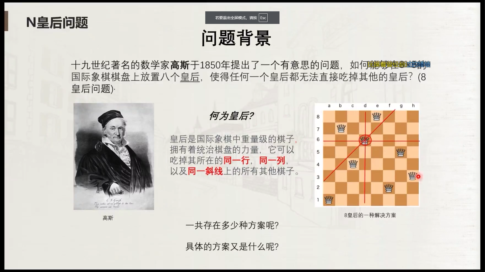
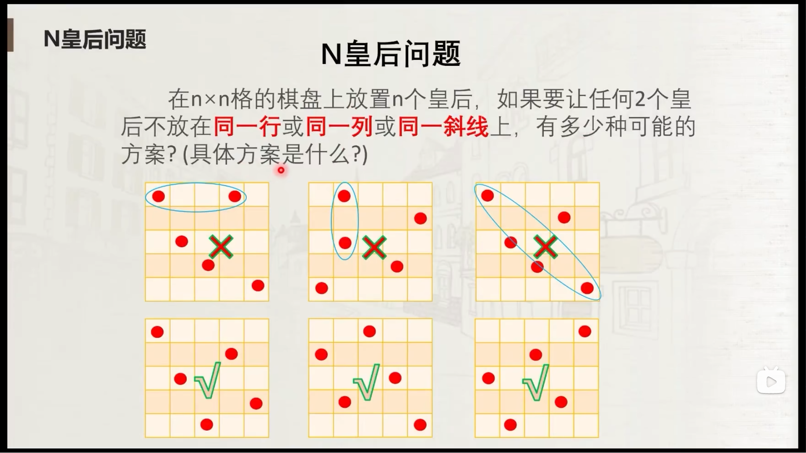
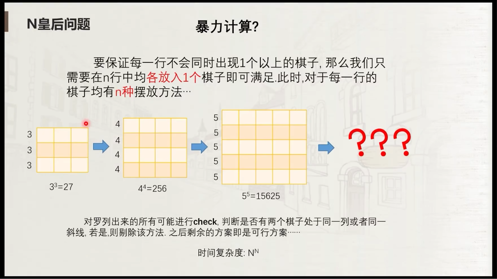
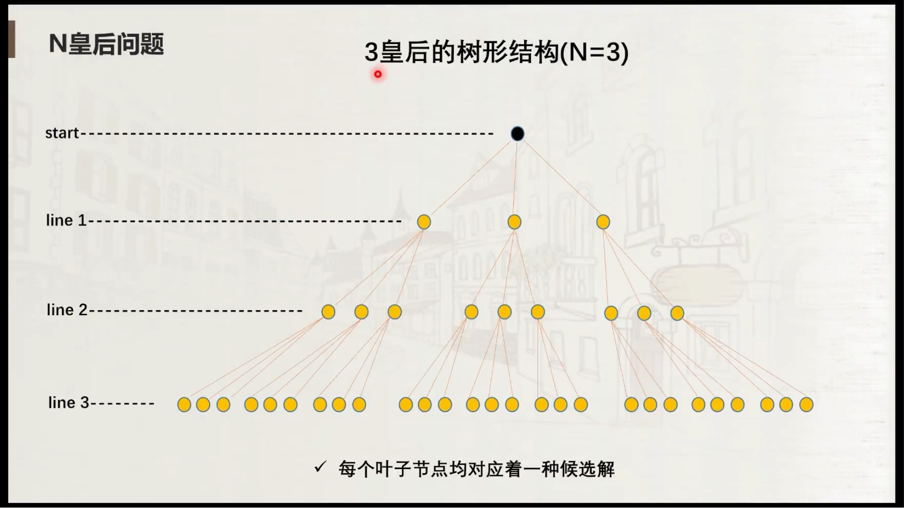
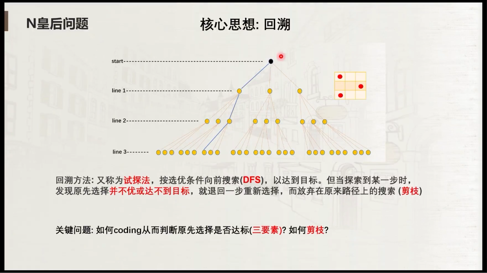
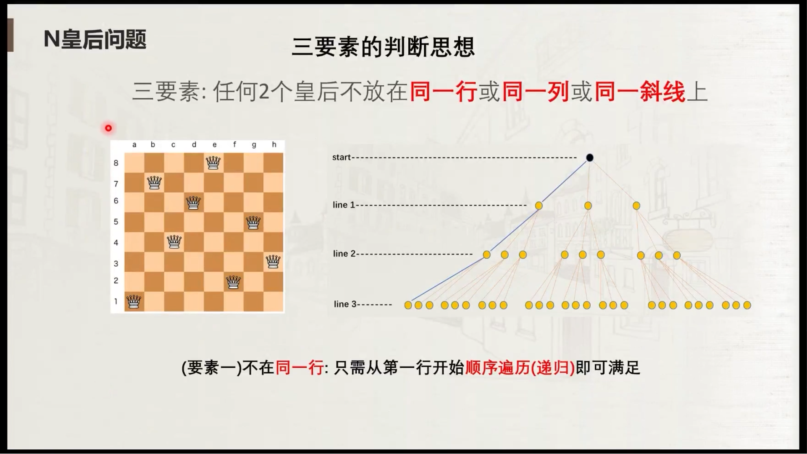
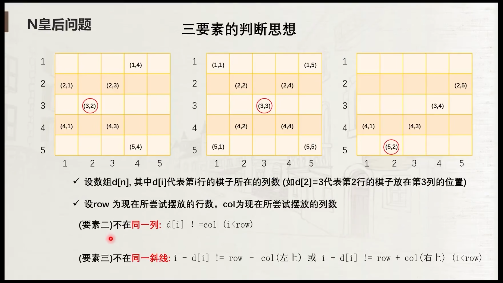
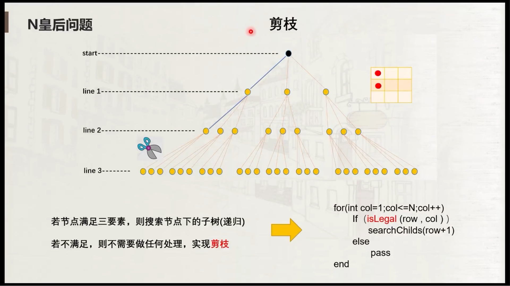
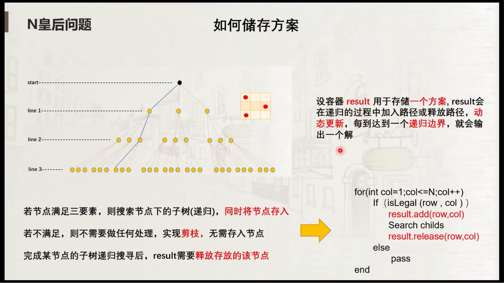
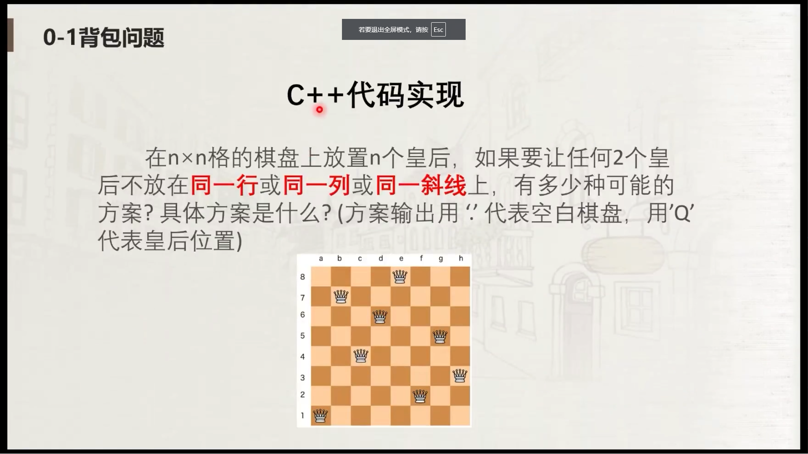

<p>按照国际象棋的规则，皇后可以攻击与之处在同一行或同一列或同一斜线上的棋子。</p>

<p><strong>n&nbsp;皇后问题</strong> 研究的是如何将 <code>n</code>&nbsp;个皇后放置在 <code>n×n</code> 的棋盘上，并且使皇后彼此之间不能相互攻击。</p>

<p>给你一个整数 <code>n</code> ，返回所有不同的&nbsp;<strong>n<em>&nbsp;</em>皇后问题</strong> 的解决方案。</p>

<div class="original__bRMd"> 
 <div> 
  <p>每一种解法包含一个不同的&nbsp;<strong>n 皇后问题</strong> 的棋子放置方案，该方案中 <code>'Q'</code> 和 <code>'.'</code> 分别代表了皇后和空位。</p> 
 </div>
</div>

<p>&nbsp;</p>

<p><strong>示例 1：</strong></p> 
 
<pre>
<strong>输入：</strong>n = 4
<strong>输出：</strong>[[".Q..","...Q","Q...","..Q."],["..Q.","Q...","...Q",".Q.."]]
<strong>解释：</strong>如上图所示，4 皇后问题存在两个不同的解法。
</pre>

<p><strong>示例 2：</strong></p>

<pre>
<strong>输入：</strong>n = 1
<strong>输出：</strong>[["Q"]]
</pre>

<p>&nbsp;</p>

<p><strong>提示：</strong></p>

<ul> 
 <li><code>1 &lt;= n &lt;= 9</code></li> 
</ul>

<div><li>👍 2170</li><li>👎 0</li></div>














### 哔哩哔哩C视频地址
https://www.bilibili.com/video/BV1AT41117LP/?spm_id_from=333.337.search-card.all.click&vd_source=27b6d6124ae2b2ecf64172cf435466b1
### 解题思路：N 皇后问题

N 皇后问题的目标是将 N 个皇后放置在 N×N 的棋盘上，使得它们互相之间不会发生攻击。皇后可以攻击同一行、同一列、同一对角线的其他棋子。

为了求解这个问题，可以采用 **回溯法**。回溯法是一种通过递归进行深度优先搜索的方法，我们将通过尝试每种可能的放置方式，并在发现某个放置方式不符合条件时撤销当前的选择（即回溯）。

### **步骤概述**

1. **初始化棋盘**：首先，我们需要为 N×N 的棋盘初始化一个空棋盘。每个位置的初始状态是 `.`（空位），然后在搜索过程中将皇后 `Q` 放置到合适的位置。

2. **递归深度优先搜索（DFS）**：从棋盘的第一行开始，尝试在每一行的所有列中放置皇后，并递归地进行下一个行的处理。

3. **合法性检查**：在每次放置皇后时，需要检查是否与之前放置的皇后产生冲突。具体的冲突条件是：
    - 同一列
    - 同一斜线（有两种斜线，分别是左上到右下和右上到左下）

4. **回溯**：如果某次尝试成功放置了一个皇后，我们就继续尝试放置下一个皇后。如果某次放置失败（即与之前的皇后冲突），就撤销当前放置的皇后，回到上一行，尝试其他位置。

5. **停止条件**：当所有皇后都被成功放置在棋盘上时，记录下这一解，并继续寻找其他解。若找到了所有解，算法结束。

### **模拟代码流程**

以下是代码的逐步流程描述：

1. **输入和初始化**：
    - 输入 `N`，表示棋盘的大小（N×N）。
    - 使用 `d[]` 数组来存储每行皇后所在的列位置。
    - 使用 `result[][]` 数组来存储当前的棋盘状态。

2. **DFS递归过程**：
    - 从第一行开始尝试放置皇后，逐行递归。
    - 对每一行，从左到右检查每一列是否可以放置皇后。如果可以，就将皇后放在该位置，并递归调用下一行的搜索。
    - 对每一行的每一列，使用 `isLegal()` 方法检查放置是否有效。该方法检查当前列是否被占用，是否与其他皇后在同一斜线。

3. **回溯**：
    - 如果当前行所有列都尝试过并且都无法放置皇后，则回到上一行撤销放置，并尝试该行的下一个位置。

4. **成功条件**：
    - 如果当前行已经成功放置了所有皇后，输出棋盘并记录解的数量。

5. **最终输出**：
    - 输出所有合法的棋盘布局，并输出解的总数。

### **回溯法代码流程**

1. **初始化棋盘和状态数组**：
   ```java
   for (int i = 1; i <= N; i++) {
       for (int j = 0; j < N; j++) {
           result[i][j] = '.'; // 初始化棋盘为空位置
       }
   }
   ```

2. **递归 DFS 搜索**：
   ```java
   public static void DFS(int row) {
       if (row == N + 1) {
           // 成功放置了 N 个皇后，打印当前棋盘
           num++;
           for (int i = 1; i <= N; i++) {
               System.out.println(new String(result[i]));
           }
           System.out.println();
           return;
       }
   
       // 尝试每一列放置皇后
       for (int col = 1; col <= N; col++) {
           if (isLegal(row, col)) {
               d[row] = col; // 放置皇后
               result[row][col - 1] = 'Q'; // 更新棋盘
               DFS(row + 1); // 递归进入下一行
               result[row][col - 1] = '.'; // 回溯，撤销放置
           }
       }
   }
   ```

3. **合法性检查**：
   ```java
   public static boolean isLegal(int row, int col) {
       boolean judge = true;
       for (int i = 1; i < row; i++) {
           if (d[i] == col) { // 检查同一列
               judge = false;
               break;
           }
           if (i - d[i] == row - col) { // 检查左对角线
               judge = false;
               break;
           }
           if (i + d[i] == row + col) { // 检查右对角线
               judge = false;
               break;
           }
       }
       return judge;
   }
   ```

### **示例**

假设输入 `N = 4`，棋盘大小为 4×4，我们可以模拟代码的执行过程：

- **初始棋盘**：
  ```
  . . . .
  . . . .
  . . . .
  . . . .
  ```

- **递归过程**：
    - 第一行放置皇后，在第一列放置：
      ```
      Q . . .
      . . . .
      . . . .
      . . . .
      ```

    - 第二行检查，放置在第二列：
      ```
      Q . . .
      . Q . .
      . . . .
      . . . .
      ```

    - 第三行检查，放置在第三列：
      ```
      Q . . .
      . Q . .
      . . Q .
      . . . .
      ```

    - 第四行检查，放置在第四列：
      ```
      Q . . .
      . Q . .
      . . Q .
      . . . Q
      ```

- **回溯**：
    - 如果某一行的某列无法放置皇后（即与之前的皇后冲突），就回到上一行并尝试下一列。

- **最终解**：
  ```
  Q . . .
  . Q . .
  . . Q .
  . . . Q
  ```

### **回溯的剪枝和优化**

- **剪枝**：当检查到某个位置的放置不合法时，立即停止继续递归，并尝试该行的下一个列。
- **时间复杂度**：最坏情况下是 `O(N!)`，即所有可能的放置方式，但是通过剪枝可以有效减少搜索空间。

---

### **总结**

1. **回溯法**通过递归探索每一行的每一列的放置方式，尝试所有可能的解。
2. **剪枝**：通过判断列和斜线上的冲突来避免不必要的搜索，极大地提高了效率。
3. **输出**：每当成功放置了所有的皇后，我们就记录一个有效解，并继续尝试其他解。