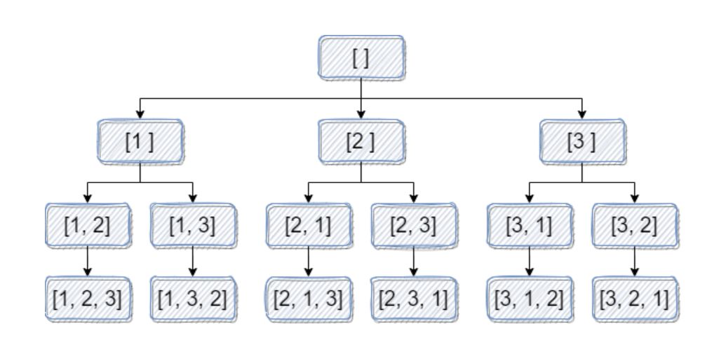

<p>给出集合&nbsp;<code>[1,2,3,...,n]</code>，其所有元素共有&nbsp;<code>n!</code> 种排列。</p>

<p>按大小顺序列出所有排列情况，并一一标记，当&nbsp;<code>n = 3</code> 时, 所有排列如下：</p>

<ol> 
 <li><code>"123"</code></li> 
 <li><code>"132"</code></li> 
 <li><code>"213"</code></li> 
 <li><code>"231"</code></li> 
 <li><code>"312"</code></li> 
 <li><code>"321"</code></li> 
</ol>

<p>给定&nbsp;<code>n</code> 和&nbsp;<code>k</code>，返回第&nbsp;<code>k</code>&nbsp;个排列。</p>

<p>&nbsp;</p>

<p><strong>示例 1：</strong></p>

<pre>
<strong>输入：</strong>n = 3, k = 3
<strong>输出：</strong>"213"
</pre>

<p><strong>示例 2：</strong></p>

<pre>
<strong>输入：</strong>n = 4, k = 9
<strong>输出：</strong>"2314"
</pre>

<p><strong>示例 3：</strong></p>

<pre>
<strong>输入：</strong>n = 3, k = 1
<strong>输出：</strong>"123"
</pre>

<p>&nbsp;</p>

<p><strong>提示：</strong></p>

<ul> 
 <li><code>1 &lt;= n &lt;= 9</code></li> 
 <li><code>1 &lt;= k &lt;= n!</code></li> 
</ul>

<div><li>👍 859</li><li>👎 0</li></div>

这题如果采用最原始的暴力枚举，就需要从小到大依次找出`k`个排列，然后才能得出答案，就相当于我们需要遍历第`k`个排列前的整棵解答树。


但这是排列，我们能不能用一些数学方法来加快这个过程呢？



通过上图我们可以看到，这是生成所有排列的一个解答树。


它的深度，以及每层节点的分叉数量都是固定的，所以……


我们是不是能够不用遍历这个子树，便可以知道子树的大小？从而确定所求的第`k`大的排列是否会在这个子树内出现？


那么既然知道了这个规律，我们就来总结一下每一层的分叉数的规律——第一层3个，第二层 2个，第三层1个……再把这些分叉数乘起来，是不是就是对应的子树的大小了？


是的，其实就是一个阶乘的关系，那么就可以通过这个来快速跳过第`k`个排列之前的排列，不用再去依次遍历到整个解答树的叶子节点，节省了大量的时间。

要解决这个问题，可以采用 **递归** 和 **数学公式** 相结合的方法。问题的关键是如何通过对排列数的规律进行分析，直接计算出第 k 个排列。

### 思路：

我们从给定的集合 `[1, 2, ..., n]` 中选择数字，逐步构建排列。可以利用 **阶乘（factorial）** 来帮助我们确定在某一位置上应该选择哪个数字。

#### 步骤分析：

1. **第一步：确定第一位数字**  
   假设当前有 `n` 个元素，可以将这些元素分成 `n` 组，每组有 `(n-1)!` 个排列。每组的开头数字不同，所以我们可以利用 `k` 来确定第一个数字应该是什么。
    - 如果 `k <= (n-1)!`，则第一个数字是 `1`，
    - 如果 `k > (n-1)!`，则第一个数字是 `2`，依此类推。  
      然后，我们更新 `k` 为 `k - (x-1) * (n-1)!`，其中 `x` 是我们选择的数字。

2. **第二步：确定第二位数字**  
   剩下的数字继续进行类似的处理，依次递归下去。

3. **直到所有数字确定为止**，返回排列。

### 代码实现：

```text
import text.util.ArrayList;
import text.util.List;

class Solution {
    public String getPermutation(int n, int k) {
        // Step 1: Prepare a list of numbers to pick from
        List<Integer> nums = new ArrayList<>();
        for (int i = 1; i <= n; i++) {
            nums.add(i);
        }
        
        // Step 2: Calculate the factorial of n
        int fact = 1;
        for (int i = 1; i < n; i++) {
            fact *= i;
        }
        
        // Step 3: Adjust k to be zero-indexed
        k--;
        
        StringBuilder result = new StringBuilder();
        
        // Step 4: Generate the permutation
        for (int i = n; i >= 1; i--) {
            // Find the index of the current number
            int index = k / fact;
            result.append(nums.get(index));  // Add the number at the index to the result
            nums.remove(index);  // Remove the number from the list
            
            // Update k and fact for the next iteration
            k %= fact;
            if (i > 1) {
                fact /= (i - 1);
            }
        }
        
        return result.toString();
    }
}
```

### 代码解释：

1. **初始化数据**：
    - 使用一个 `List<Integer>` 来存储从 `1` 到 `n` 的数字。我们会在生成排列时逐步从中删除数字。
    - 计算 `n!`，我们从最开始就计算好了所有的阶乘，以便在后续过程中使用。

2. **递归式生成排列**：
    - 我们通过每一步确定当前选择哪个数字。`k / fact` 给出了第一个数字应该在剩余数字中的哪个位置，然后通过 `k %= fact` 更新 k 的值，准备计算下一个数字。
    - 每次确定一个数字后，我们将该数字从 `nums` 中移除，并调整 `fact` 为剩下数字个数的阶乘。

3. **终止条件**：
    - 递归的停止条件是我们已经找到了所有的数字，所有数字都被放入 `result` 中，最终返回生成的排列字符串。

### 示例：

#### 输入1：
```text
n = 3, k = 3
```

- 第一步：从 `[1, 2, 3]` 选择第一个数字。由于 `k = 3`，可以计算 `k = 3` 时属于第二组（即以 `2` 开头的排列）。剩余 `k = 3 - 2 * 2 = 1`。
- 第二步：从 `[1, 3]` 选择第一个数字。`k = 1`，所以选择 `1`。剩余 `k = 1 - 0 = 1`。
- 第三步：剩余的数字 `[3]` 直接选择 `3`。

最终返回的排列为 `"213"`。

#### 输入2：
```text
n = 4, k = 9
```

- 第一步：从 `[1, 2, 3, 4]` 中选择第一个数字。`k = 9`，属于第三组（以 `2` 开头）。剩余 `k = 9 - 2 * 6 = 3`。
- 第二步：从 `[1, 3, 4]` 中选择第一个数字。`k = 3`，选择 `3`，剩余 `k = 3 - 2 * 2 = 1`。
- 第三步：从 `[1, 4]` 中选择第一个数字。`k = 1`，选择 `1`。
- 第四步：剩余的数字 `4` 直接选择。

最终返回的排列为 `"2314"`。

### 时间复杂度分析：

- 每次我们计算一个位置的数字，只需做常数次运算（包括除法和取余运算）。
- 总体时间复杂度是 O(n)，其中 n 是给定的整数 n。

### 结论：

该解法利用了数学上的排列规律和递归回溯，避免了暴力生成所有排列的复杂度，具有很高的效率，能够快速计算出第 k 个排列。