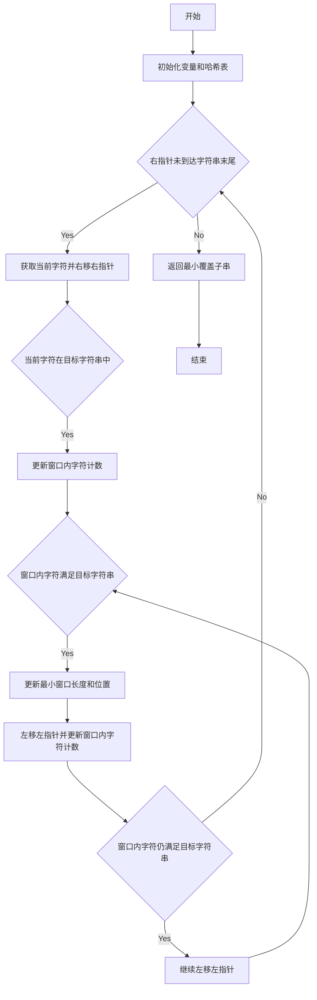

给你一个字符串 <code>s</code> 、一个字符串 <code>t</code> 。返回 <code>s</code> 中涵盖 <code>t</code> 所有字符的最小子串。如果 <code>s</code> 中不存在涵盖 <code>t</code> 所有字符的子串，则返回空字符串 <code>""</code> 。

&nbsp;

<strong>注意：</strong>

<ul> 
 <li>对于 <code>t</code> 中重复字符，我们寻找的子字符串中该字符数量必须不少于 <code>t</code> 中该字符数量。</li> 
 <li>如果 <code>s</code> 中存在这样的子串，我们保证它是唯一的答案。</li> 
</ul>

&nbsp;

<strong>示例 1：</strong>

<pre>
<strong>输入：</strong>s = "ADOBECODEBANC", t = "ABC"
<strong>输出：</strong>"BANC"
<strong>解释：</strong>最小覆盖子串 "BANC" 包含来自字符串 t 的 'A'、'B' 和 'C'。
</pre>

<strong>示例 2：</strong>

<pre>
<strong>输入：</strong>s = "a", t = "a"
<strong>输出：</strong>"a"
<strong>解释：</strong>整个字符串 s 是最小覆盖子串。
</pre>

<strong>示例 3:</strong>

<pre>
<strong>输入:</strong> s = "a", t = "aa"
<strong>输出:</strong> ""
<strong>解释:</strong> t 中两个字符 'a' 均应包含在 s 的子串中，
因此没有符合条件的子字符串，返回空字符串。</pre>

&nbsp;

<strong>提示：</strong>

<ul> 
 <li><code>m == s.length</code></li> 
 <li><code>n == t.length</code></li> 
 <li><code>1 &lt;= m, n &lt;= 105</code></li> 
 <li><code>s</code> 和 <code>t</code> 由英文字母组成</li> 
</ul>

&nbsp;
 
<strong>进阶：</strong>你能设计一个在 
<code>o(m+n)</code> 时间内解决此问题的算法吗？

<li>👍 3065</li><li>👎 0</li>

### 代码功能解释

这段Java代码实现了一个寻找最小覆盖子串的算法。具体功能如下：

1. **初始化**：创建两个哈希表 `bucket1` 和 `bucket2`，分别存储目标字符串 `t` 中每个字符的出现次数和当前窗口中每个字符的出现次数。
2. **滑动窗口**：使用双指针 `lef` 和 `rig` 维护一个滑动窗口，遍历字符串 `s`。
3. **更新窗口**：当右指针 `rig` 扫描到的字符在 `bucket1` 中存在时，更新 `bucket2` 并检查是否满足条件。
4. **收缩窗口**：当窗口内的字符满足 `t` 的所有字符时，尝试收缩左指针 `lef`，更新最小窗口的长度和起始位置。
5. **结果返回**：遍历结束后，返回最小覆盖子串。

### Mermaid 控制流图

### 详细解释

1. **初始化变量和哈希表**：
    - 创建 `StringBuilder` 对象 `res` 用于存储结果。
    - 创建两个 `HashMap` 对象 `bucket1` 和 `bucket2`，分别存储目标字符串 `t` 中每个字符的出现次数和当前窗口中每个字符的出现次数。
    - 初始化左右指针 `lef` 和 `rig`，以及记录最小窗口长度和位置的变量 `ansLength`、`ansLef` 和 `ansRig`。

2. **滑动窗口**：
    - 使用 `while` 循环，当右指针 `rig` 小于字符串 `s` 的长度时，继续执行。
    - 获取当前字符 `nowPos` 并右移右指针 `rig`。

3. **更新窗口**：
    - 如果当前字符 `nowPos` 在 `bucket1` 中存在，则更新 `bucket2` 中该字符的计数。
    - 检查当前字符的计数是否等于 `bucket1` 中的计数，如果是，则增加满足条件的字符数 `num`。

4. **收缩窗口**：
    - 当窗口内的字符满足目标字符串 `t` 的所有字符时，进入内层 `while` 循环。
    - 更新最小窗口的长度和起始位置。
    - 左移左指针 `lef`，并更新窗口内字符的计数。
    - 检查窗口内字符是否仍满足目标字符串，如果是，则继续左移左指针，否则退出内层循环。

5. **结果返回**：
    - 遍历结束后，如果 `ansLength` 仍为初始值 `s.length() + 1`，则返回空字符串。
    - 否则，构建并返回最小覆盖子串。