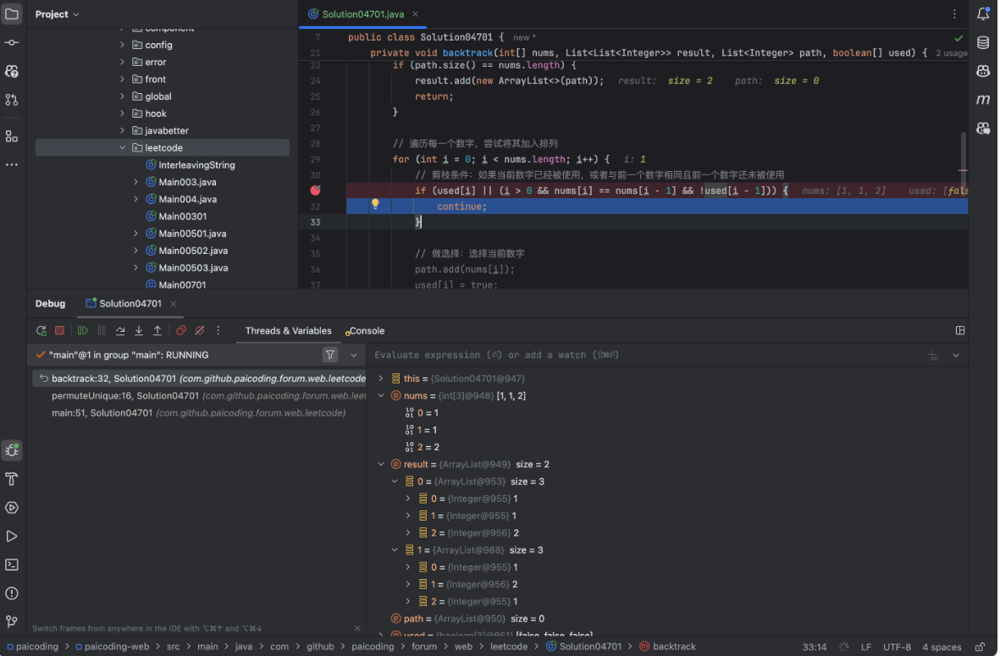

### 题意

给定一个可包含重复数字的序列 `nums` ，_**按任意顺序**_ 返回所有 **不重复** 的全排列。

### 难度

中等

### 示例

**示例 1**：

```plain
输入：nums = [1,1,2]
输出：
[[1,1,2],
 [1,2,1],
 [2,1,1]]
```

**示例 2**：

```plain
输入：nums = [1,2,3]
输出：[[1,2,3],[1,3,2],[2,1,3],[2,3,1],[3,1,2],[3,2,1]]
```

### 分析

这道题是 [046.全排列](https://paicoding.com/column/7/46) 的延续。**046.全排列** 中没有重复数字，但 047 中有重复元素。


但是，`nums`的元素顺序并不会影响结果，所以我们不妨把元素从小到大排个序。在之前的题解中，我们知道，排序在很多时候可以减少题解的复杂度。


这道题也是一样的，当我们对 nums 进行排序后，就可以保证相同的数字会相邻，方便我们在回溯过程中跳过重复的数字。


好，来看这个例子：`nums = [1,1,2]`，如果按照 **046.全排列** 思路的话，我们会得到这样的结果：

```plain
ans = [
[1,1,2],
[1,2,1],
[1,1,2],
[1,2,1],
[2,1,1],
[2,1,1]
]
```

可以看到，我们得到了重复的结果，但其实我们只要保证同个位置同个元素只被填入一次就可以避免重复，对吧？


然后在回溯和剪枝中，我们使用布尔数组 used 记录哪些元素已经被选中，避免重复使用。


在回溯过程中，如果当前数字与前一个数字相同，并且前一个数字还没有被使用（`!used[i-1]`），说明在同一层已经选择过该数字，应该跳过这个选择。

```text
if (used[i] || (i > 0 && nums[i] == nums[i - 1] && !used[i - 1])) {
    continue;
}
```

关于这一点，很容易搞混，为什么是 `!used[i-1]` 而不是 `used[i-1]` 呢？


我截个图，debug 的时候就明白了。



当输入是 `[1,1,2]` 的时候，从第 1 个 1 开始，我们可以得到 `[[1(0),1(1),2],[1(0),2,1(1)]]`，然后我们回溯到第 2 个 1 的时候，我们需要跳过 `1(1),1(0),2` 这个选择， 对吧？


ok，我们来看完整的题解。

```text
class Solution04701 {
    public List<List<Integer>> permuteUnique(int[] nums) {
        List<List<Integer>> result = new ArrayList<>();
        List<Integer> path = new ArrayList<>();
        boolean[] used = new boolean[nums.length];

        // 排序数组，以便剪枝
        Arrays.sort(nums);

        backtrack(nums, result, path, used);
        return result;
    }

    // 回溯函数
    private void backtrack(int[] nums, List<List<Integer>> result, List<Integer> path, boolean[] used) {
        // 如果当前排列的长度等于 nums 的长度，说明找到一个完整的排列
        if (path.size() == nums.length) {
            result.add(new ArrayList<>(path));
            return;
        }

        // 遍历每一个数字，尝试将其加入排列
        for (int i = 0; i < nums.length; i++) {
            // 剪枝条件：如果当前数字已经被使用，或者与前一个数字相同且前一个数字还未被使用
            if (used[i] || (i > 0 && nums[i] == nums[i - 1] && !used[i - 1])) {
                continue;
            }

            // 做选择：选择当前数字
            path.add(nums[i]);
            used[i] = true;

            // 继续递归处理剩余数字的排列
            backtrack(nums, result, path, used);

            // 撤销选择：回溯
            path.remove(path.size() - 1);
            used[i] = false;
        }
    }

    public static void main(String[] args) {
        Solution04701 solution = new Solution04701();
        int[] nums = {1, 1, 2};
        List<List<Integer>> result = solution.permuteUnique(nums);
        System.out.println(result); // 输出所有不重复的全排列
    }
}
```

比起 046，这里只是多了一个排序和一个剪枝操作。